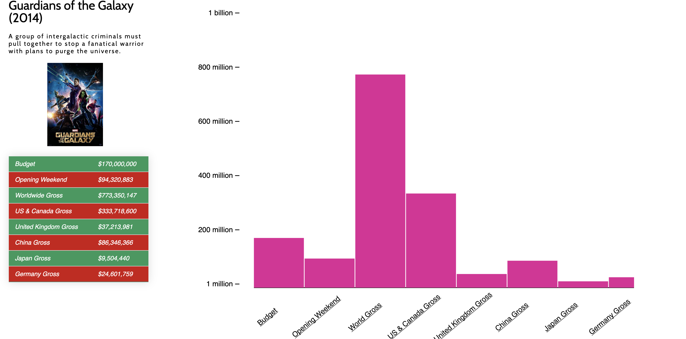
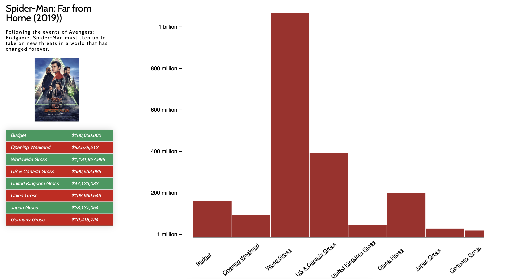
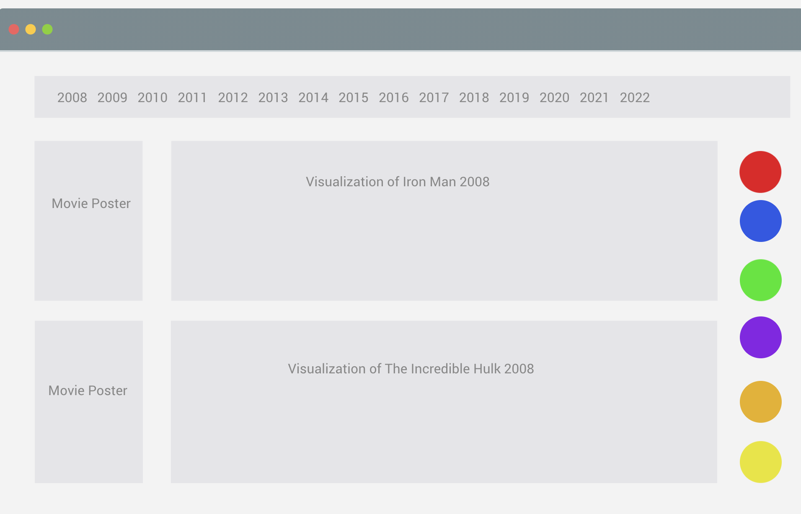
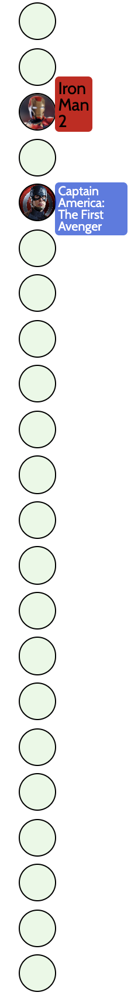

# Vision

Vision is a single-page data visualization project using vanilla JavaScript, HTML, CSS, and the D3.js library.

This application displays data from the Marvel Cinematic Universe dating back to the first _Iron Man_ film in 2008. Information displayed include budget, worldwide gross, United States + Canada Gross, China Gross, and Japan Gross.

## Background

Coming from a Film Production background, I enjoy just about any movie. Growing up reading comics and spending countless hours studying up just about every hero and villain in early 2010, my love for Marvel comics grew and even more so, the Marvel Cinematic Universe films.

I created my own `movies.json` using information from [IMDbPro](https://pro.imdb.com/).

```
{
    "Title": "Captain America: The First Avenger",
    "Release Date": "July 22, 2011",
    "Rating": 80,
    "Budget": 140,
    "Opening Weekend": 65,
    "World Gross": 370,
    "US & Canada Gross": 177,
    "United Kingdom Gross": 15,
    "China Gross": 3,
    "Japan Gross": 3,
    "Germany Gross": 5
  },
  {
    "Title": "Marvel's The Avengers",
    "Release Date": "May 4, 2012",
    "Rating": 91,
    "Budget": 220,
    "Opening Weekend": 207,
    "World Gross": 1519,
    "US & Canada Gross": 623,
    "United Kingdom Gross": 81,
    "China Gross": 86,
    "Japan Gross": 33,
    "Germany Gross": 31
  },
```

## Architecture

| Technologies                                                                                            | Used                                     |
| ------------------------------------------------------------------------------------------------------- | ---------------------------------------- |
| [HTML](https://developer.mozilla.org/en-US/docs/Web/Guide/HTML/HTML5)                                   | [D3.js](https://d3js.org/)               |
| [CSS](https://www.w3schools.com/css/)                                                                   | [Font Awesome](https://fontawesome.com/) |
| [Intersection Observer API](https://developer.mozilla.org/en-US/docs/Web/API/Intersection_Observer_API) |                                          |

## Functionality & MVP

Visitors will be able to:

- Enter the application through a modal.
- Scroll smoothly through a assortment of charts and containers.
- View timeline and release dates of MCU films on a table.
- Interact with Navigation Icons on the left and be anchored to the specific film.




## Initial Wireframe



# D3.js

D3.js is a JavaScript library for manipulating documents based on data. `D3` helped bring my application to life juxtaposed to HTML, CSS, and SVG. Through a process of `.append()`, `.attr()`, `.enter()` among other `Selections`, I was able to manipuilate the `xAxis` and `yAxis` of my application to create a smooth flow of rendering the appropriate bar chart. D3 made an efficient manipulation of documents based on data.

```
const createVision = (movieData, idx) => {
  let margin = { top: 10, right: 40, bottom: 25, left: 60 }
  let width = 700 - margin.left - margin.right
  let height = 450 - margin.top - margin.bottom
  let data = Object.values(movieData).slice(3)
  let numberOfColumns = 8

  let x_axisLength = width
  let targetSVG = 'slide-svg-' + idx
  let targetSlideRect = 'slide-svg-' + idx + '-rect'
  let xScale = d3.scaleLinear().domain([0, numberOfColumns]).range([20, width])
  let yScale = d3.scaleLinear().domain([10, 0]).range([25, 400])

  let svg = d3
    .select('#vision')
    .append('svg')
    .attr('class', `${targetSVG} hidden`)
    .attr('viewBox', `0 50 650 100`)
    .attr('preserveAspectRatio', 'xMinYMin meet')

  let xAxis = d3
    .axisBottom()
    .scale(xScale)
    .tickSize(0)
    .tickFormat(function (d) {
      return Object.keys(movieData).slice(3)[d]
    })

  let formatValue = d3.format('.1s')

  let yAxis = d3
    .axisLeft(yScale)
    .ticks(4)
    .tickFormat((tickCount) => {
      switch (tickCount) {
        case 10:
          return '1 billion'
          break
        case 0:
          return '1 million'
        default:
          return formatValue(tickCount) + '00 million'
      }
    })
```

# Intersection Observer API

The Intersection Observer API provides a way to asynchronously observe changes in the intersection of a target element with an ancestor element or with a top-level document's viewport. With this API, I was able to create a reference to each container/slide my application adnd apply a anchor to successfully allow transitions of my graphs upon scrolling up or down on the page.

```
let options = {
  root: document.querySelector('#scrollArea'),
  rootMargin: '0px',
  threshold: 1.0
}

let observer = new IntersectionObserver(callback, options);
```



## References

[Shirley Wu - Frontend Masters](https://frontendmasters.com/courses/d3/)

[Academind](https://www.youtube.com/playlist?list=PL55RiY5tL51r1NlkJLzVhui1S480gnuNG)

[Intersection Observer API](https://developer.mozilla.org/en-US/docs/Web/API/Intersection_Observer_API)

[Creating A Bar Chart](https://codeburst.io/how-i-created-a-bar-chart-using-d3-js-data-visualization-library-7a1f1ee296e5)

[Let's Make A Bar Chart](https://observablehq.com/@d3/lets-make-a-bar-chart)

[Bar-Chart-With-D3](https://www.htmlgoodies.com/beyond/javascript/generate-a-bar-chart-with-d3.js.html)

[Bar-Chart-Tutorials](https://www.youtube.com/watch?v=BDpBAFvdjYo)

[IMDbPro](https://pro.imdb.com/)
