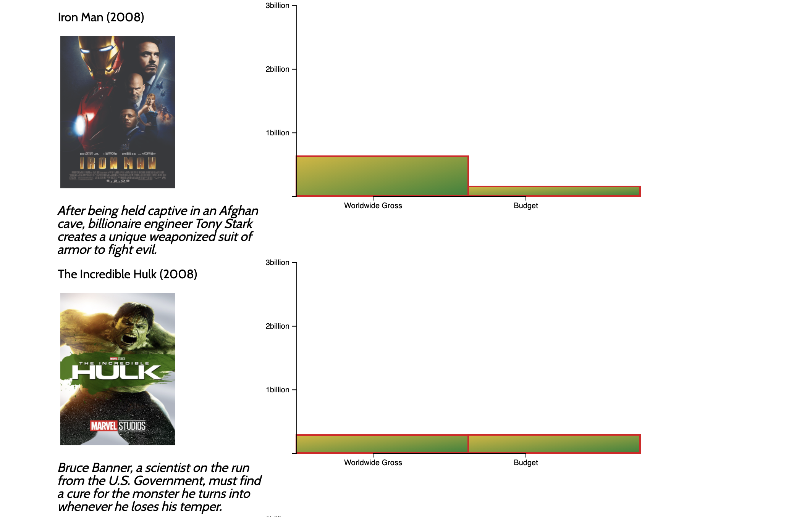

# Vision

Vision is a single-page data visualization project to display relevent data from the Marvel Cinematic Universe dating back to the first Iron Man film in 2008.

## Background

_Vision_ will put an emphasis on relevant data such as release date, worldwide gross, production budget, RottenTomatoes rating, and appearances. The single-page scroller and hovering effects provide interactivity and serves to make data enjoyable to digest.


## Architecture

Vision is implemented with the following technologies:

- `HTML` for single page rendering.
- `CSS` for simple and clean readability.
- `JavaScript` for user interaction.
- `D3.js` for visually appealing data.

```
  const svg = d3
    .select(`#mov-${i}`)
    .append('div')
    .append('svg')
    .attr('height', svgHeight)
    .attr('width', rectWidth)
    .style('overflow', 'visible')
```

## Functionality & MVP

Users will be able to:

- View timeline and see release dates of MCU movies.
- Scroll between graphs and read relevant information.
- Interact with icons and be take to the specific movie



## Initial Wireframe


## References

[Shirley Wu - Frontend Masters](https://frontendmasters.com/courses/d3/)

[Academind](https://www.youtube.com/playlist?list=PL55RiY5tL51r1NlkJLzVhui1S480gnuNG)

[Creating A Bar Chart](https://codeburst.io/how-i-created-a-bar-chart-using-d3-js-data-visualization-library-7a1f1ee296e5)

[Let's Make A Bar Chart](https://observablehq.com/@d3/lets-make-a-bar-chart)

[Bar-Chart-With-D3](https://www.htmlgoodies.com/beyond/javascript/generate-a-bar-chart-with-d3.js.html)

[Bar-Chart-Tutorials](https://www.youtube.com/watch?v=BDpBAFvdjYo)
